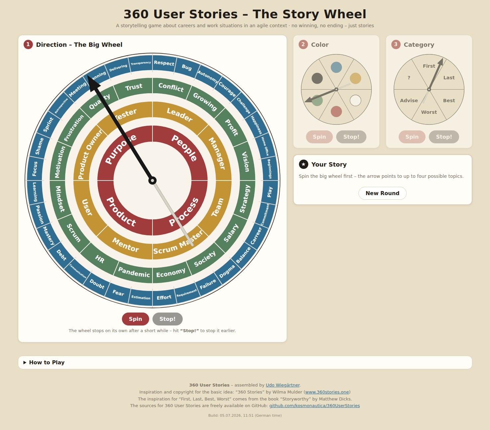

# 360 User Stories – The Story Wheel

A storytelling game about careers and work situations in an agile context – as a purely static browser application.

Based on “360 Stories” by Wilma Mulder ([[www.360stories.one](https://www.taleswapper.com/360-stories-english-version/)]([https://www.360stories.one](https://www.taleswapper.com/360-stories-english-version/))),
adapted by Udo Wiegärtner for job situations in an agile context.

**Play it live:** https://kosmonautica.github.io/360UserStories/

## How to play

1. **Direction** – Spin the big wheel (it stops on its own after a short while, or hit “Stop!” –
   traditionally someone else calls the stop). The arrow points to up to four possible topics, one per ring;
   they are highlighted on the wheel and listed beneath it.
2. **Color** – The color wheel decides which of the four topics you'll tell a story about; the color matches the ring.
   - **Black = Blackbox:** your co-players pick one of the four topics for you – tap it.
   - **White = Wildcard:** you pick one of the four topics yourself – tap it.
3. **Category** – Decides what kind of story is wanted: First, Last, Best, Worst, Advise, or “?”
   (= you pick the kind of story yourself).

Once topic and category are set, your storytelling mission pops up full-screen,
e.g. *“Tell a personal story about the term ‘Conflict’ you connect with ‘Worst’.”*
Tap “New Round” for the next storyteller.

Stories usually take 2–3 minutes. No commenting, no follow-up questions –
after each story simply say “Thanks for sharing”. There is no winning and no ending.

## Play locally

Simply **open `index.html` in your browser** – no server, no build, no dependencies.
The game works offline with a double-click; keep `topics.js` and `categories.js` next to `index.html`.

## Customizing the words

- **`topics.js`** – the four word rings of the big wheel. Edit any word; just keep the counts
  at 32 / 16 / 8 / 4 and the clockwise order (the rings nest: two outer words belong to one
  inner word).
- **`categories.js`** – the six story categories of wheel 3 (label + explanation question).

## Features

- Faithful rebuild of the original story wheel: 4 rings with 4 / 8 / 16 / 32 topics, drawn as SVG.
- Wheels spin with natural deceleration and stop on their own; manual early stop supported.
- After each step the page scrolls to the next wheel and pulses it – works great on phones.
- The hit sector stays in full color while the rest of the wheel fades out.
- Guided Blackbox/Wildcard topic picking with pulsing, tappable topic chips.
- Full-screen “storytelling mission” overlay at the end.
- Fully responsive, plain static HTML/JS (no server, no build step), English UI.
